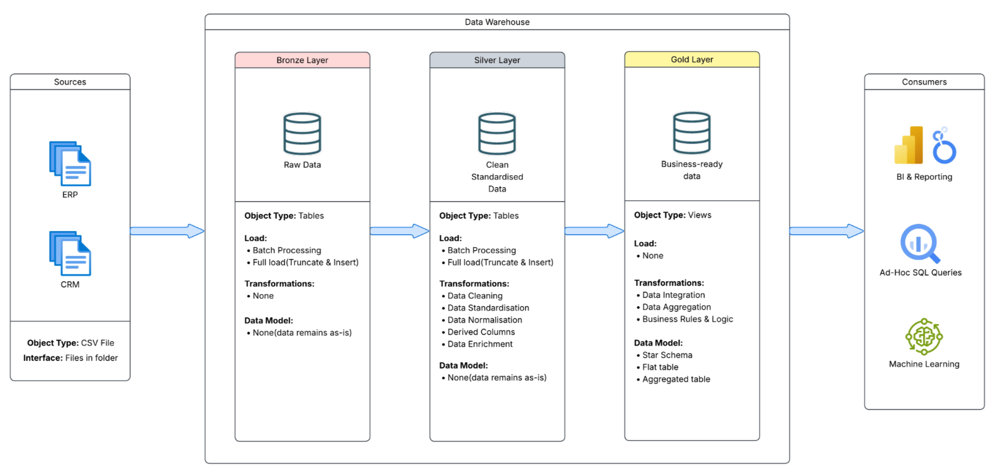

# Data warehousing project

This project demonstrates a comprehensive data warehousing and analytics solution, from building a data warehouse to generating actionable insights.

---

## Project-Overview

This project involves:

- Data Architecture: Designing a Modern Data Warehouse Using Medallion Architecture Bronze, Silver, and Gold layers.
- ETL Pipelines: Extracting, transforming, and loading data from source systems into the warehouse.
- Data Modeling: Developing fact and dimension tables optimized for analytical queries.
- Analytics & Reporting: Creating SQL-based reports and dashboards for actionable insights.

---

## Project Requirements

### Building the Data Warehouse (Data Engineering)

#### Objective

Developing a modern data warehouse using SQL Server to consolidate sales data, enabling analytical reporting and informed decision-making.

#### Specifications

- **Data Sources**: Import data from two source systems (ERP and CRM) provided as CSV files.
- **Data Quality**: Cleanse and resolve data quality issues prior to analysis.
- **Integration**: Combine both sources into a single, user-friendly data model designed for analytical queries.
- **Scope**: Focus on the latest dataset only; historization of data is not required.
- **Documentation**: Provide clear documentation of the data model to support both business stakeholders and analytics teams.

---

### BI: Analytics & Reporting (Data Analysis)

#### Objective

Develop SQL-based analytics to deliver detailed insights into:
**Customer Behavior**
**Product Performance**
**Sales Trends**
These insights empower stakeholders with key business metrics, enabling strategic decision-making.

---

### Data Architecture

The architecture of choice was the Medallion Architecture, split into three layers: Bronze, Silver, and Gold layers.

- **The Bronze Layer**: This layer sores raw data from the source systems in its original form. The data is ingested from CSV Files into SQL Server Database
- **Silver Layer**: The data cleansing, standardization, and normalization processes are done in this layer to prepare data for analysis.
- **Gold Layer**: This layer is where business-ready data resides. The data is modeled into a star schema as required for reporting and analytics.



#### Technology Stack

- VS Code
- GitHub (ehm...yeah?)
- SQL Server
- Docker Desktop: To create a container for running sql server. I had some challenges with bulk inserting since the files were not accessible from my local   computer.
  I used azure sql edge with a container volume for data residence

    ```BASH
    docker volume create sqlserver_data

    docker run -e "ACCEPT_EULA=Y" -e "MSSQL_SA_PASSWORD=<your_password>" \
      -p 1433:1433 --name sqlserver \
      -v sqlserver_data:/var/opt/mssql \
      -v /Users/example/path/to/your/data:/var/opt/source \
      -d mcr.microsoft.com/azure-sql-edge:latest
    ```
  
  To start the server, run

  ```BASH
  docker start sqlserver
  ```
